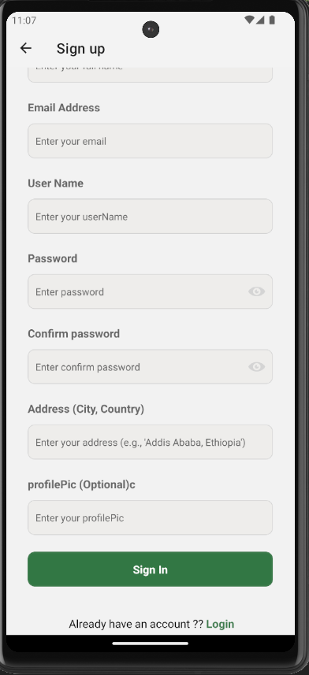
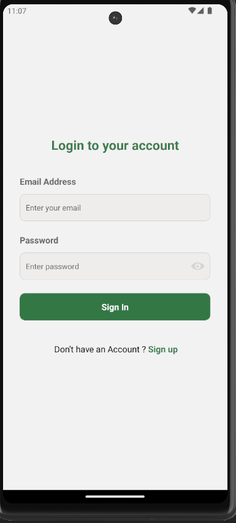
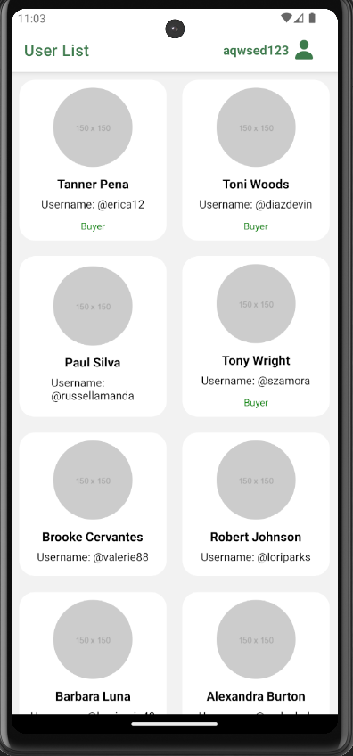
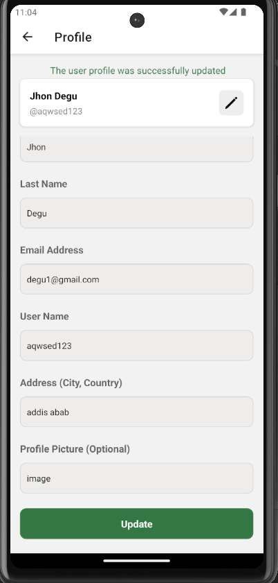

# Borsa Frontend Exercise

## Description

### Signup Screen

- **Endpoint:** `POST /register/v2`
- **Functionality:** Allows new users to register by providing necessary details.
## Screenshots



### Login Screen

- **Endpoint:** `POST /login`
- **Functionality:** Users can log in by providing their email and password.
## Screenshots




### Home Screen

- **Endpoint:** `GET /fetch/dummy/user-v2`
- **Functionality:** Retrieves and displays a list of 100 mock users.
## Screenshots




### Edit Profile Screen

- **Endpoint:** `PUT /profile?id=${userId}`
- **Functionality:** Enables logged-in users to view and edit their personal information.
## Screenshots




## Getting Started

To get started with the Borsa Frontend Exercise, follow these steps:

1. **Clone the Repository:** Clone the Borsa Frontend Exercise repository to your local machine using Git:
    ```bash
    git clone https://github.com/Yohannes14/-Borsa-Frontend-Exercise-.git
    ```

2. **Navigate to the Project Directory:** Navigate to the directory of the cloned project:
    ```bash
    cd take-home-exe
    ```

3. **Install Dependencies:** Install the necessary dependencies using npm or yarn:
    ```bash
    npm install
    
    ```

4. **Run the App:** Once the dependencies are installed, you can run the app using Expo CLI:
    ```bash
    npm start
    # or
    expo start
    ```

This will start the Expo development server and open the Expo DevTools in your browser. From there, you can run the app on an iOS or Android simulator, or scan the QR code with the Expo Go app on your mobile device to run the app directly on your device.

